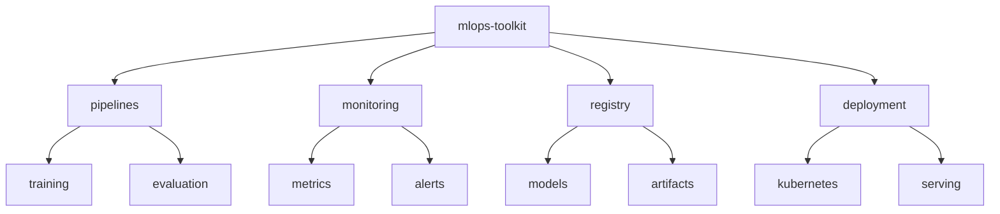

# MLOps Toolkit 🛠️

[](https://www.python.org/downloads/)
[](https://mlflow.org/)
[](https://dvc.org/)
[](https://kubernetes.io/)
[](LICENSE)

> Enterprise-grade ML infrastructure and deployment tools. Comprehensive suite of tools and implementations for managing ML lifecycle, experiments, and deployments.

[Features](#features) • [Installation](#installation) • [Quick Start](#quick-start) • [Documentation](#documentation) • [Contributing](#contributing)

## 📑 Table of Contents
- [Features](#features)
- [Project Structure](#project-structure)
- [Prerequisites](#prerequisites)
- [Installation](#installation)
- [Quick Start](#quick-start)
- [Documentation](#documentation)
  - [Components](#components)
  - [Integration](#integration)
  - [Benchmarks](#benchmarks)
- [Contributing](#contributing)
- [Versioning](#versioning)
- [Authors](#authors)
- [Citation](#citation)
- [License](#license)
- [Acknowledgments](#acknowledgments)

## ✨ Features
- Automated ML pipelines
- Experiment tracking and versioning
- Model registry and deployment
- A/B testing framework
- Monitoring and alerting
- Feature store implementation

## 📁 Project Structure



<details>
<summary>Click to expand full directory structure</summary>

```plaintext
mlops-toolkit/
├── pipelines/         # ML pipelines
│   ├── training/     # Training pipelines
│   └── evaluation/   # Evaluation pipelines
├── monitoring/       # Monitoring suite
│   ├── metrics/     # Metrics collection
│   └── alerts/      # Alerting system
├── registry/         # Model registry
├── deployment/       # Deployment tools
├── tests/           # Unit tests
└── README.md        # Documentation
```
</details>

## 🔧 Prerequisites
- Python 3.8+
- MLflow 2.9+
- DVC 3.30+
- Kubernetes 1.24+
- PostgreSQL 13+

## 📦 Installation

```bash
# Clone repository
git clone https://github.com/BjornMelin/mlops-toolkit.git
cd mlops-toolkit

# Create environment
python -m venv venv
source venv/bin/activate

# Install dependencies
pip install -r requirements.txt

# Initialize infrastructure
make init-infrastructure
```

## 🚀 Quick Start

```python
from mlops_toolkit import pipeline, monitoring

# Create training pipeline
pipeline = pipeline.MLPipeline(
    name="training-pipeline",
    steps=[
        pipeline.DataPrep(),
        pipeline.Training(),
        pipeline.Evaluation()
    ]
)

# Configure monitoring
monitoring = monitoring.ModelMonitoring(
    metrics=["accuracy", "latency"],
    alerts_config={
        "accuracy_threshold": 0.95,
        "latency_p95_ms": 100
    }
)

# Run pipeline with monitoring
pipeline.run(monitoring=monitoring)
```

## 📚 Documentation

### Components

| Component | Purpose | Integration Points | Scalability |
|-----------|---------|-------------------|-------------|
| Model Registry | Version Control | Git, DVC | High |
| Feature Store | Feature Management | PostgreSQL, Redis | Very High |
| Monitoring | Performance Tracking | Prometheus, Grafana | High |
| Pipeline Orchestration | Workflow Management | Airflow, Kubernetes | High |

### Integration
- CI/CD pipeline integration
- Kubernetes deployment
- Cloud provider support
- Monitoring stack setup

### Benchmarks
System performance metrics:

| Operation | Scale | Latency | Throughput |
|-----------|-------|---------|------------|
| Model Registration | 100 models/day | 2s | 50 ops/sec |
| Feature Serving | 10TB dataset | 20ms | 10k req/sec |
| Pipeline Execution | 50 concurrent | 5min | 20 jobs/min |

## 🤝 Contributing
- [Contributing Guidelines](CONTRIBUTING.md)
- [Code of Conduct](CODE_OF_CONDUCT.md)
- [Development Guide](DEVELOPMENT.md)

## 📌 Versioning
We use [SemVer](http://semver.org/) for versioning. For available versions, see the [tags on this repository](https://github.com/BjornMelin/mlops-toolkit/tags).

## ✍️ Authors
**Bjorn Melin**
- GitHub: [@BjornMelin](https://github.com/BjornMelin)
- LinkedIn: [Bjorn Melin](https://linkedin.com/in/bjorn-melin)

## 📝 Citation
```bibtex
@misc{melin2024mlopstoolkit,
  author = {Melin, Bjorn},
  title = {MLOps Toolkit: Enterprise ML Infrastructure Tools},
  year = {2024},
  publisher = {GitHub},
  url = {https://github.com/BjornMelin/mlops-toolkit}
}
```

## 📄 License
This project is licensed under the MIT License - see the [LICENSE](LICENSE) file for details.

## 🙏 Acknowledgments
- MLflow community
- DVC team
- Kubernetes contributors
- Open source MLOps community

---
Made with 🛠️ and ❤️ by Bjorn Melin
